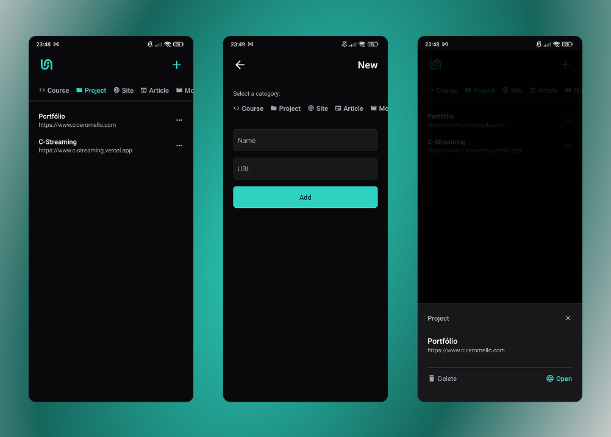

# My Links

O My Links é um gerenciador de links desenvolvido no curso de [React Native com Expo](https://app.rocketseat.com.br/journey/expo-com-react-native-curso-introdutorio/contents), da [Rocketseat 🚀](https://www.rocketseat.com.br).

Dentre as tecnologias, temos:
- **React Native**
- **Typescript**
- **Expo**
- **Material Icons (expo/vector-icons)**
- **react-native-async-storage**

Essa aplicação foi criada com intuito exclusivo de aprendizado e aprimoramento 😎.
